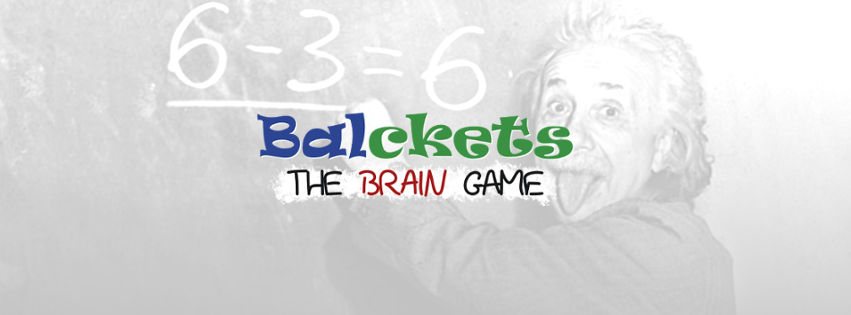
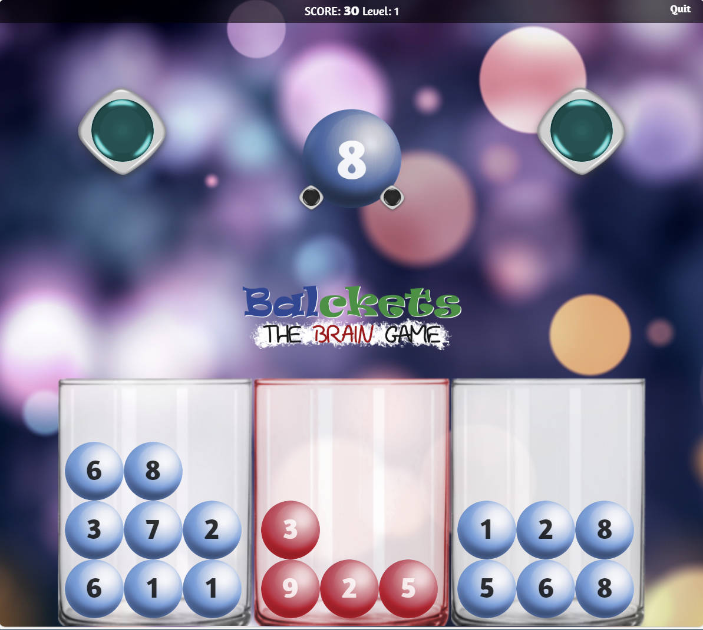

  [View this README in English](https://ekomateas.github.io/Balckets/README.html)

# Balckets — Παιχνίδι Εξάσκησης Εγκεφάλου 🧠

Το **Balckets** είναι ένα δωρεάν, διαδικτυακό παιχνίδι εξάσκησης εγκεφάλου που ενισχύει τη λογική σκέψη, τις μαθηματικές δεξιότητες και τη λήψη αποφάσεων υπό πίεση.  
Μπορείτε να το παίξετε σε υπολογιστή, tablet ή κινητό — χωρίς εγκατάσταση.

👉 **[Παίξτε Online](https://ekomateas.github.io/Balckets/balcketsgame.html)**  
📦 **[Κατεβάστε την αυτόνομη έκδοση](https://ekomateas.github.io/Balckets/balcketsgame-standalone.html)**

---

## 🎯 Πώς παίζεται

- Υπάρχουν τρεις κουβάδες: αριστερός (λευκός), δεξιός (λευκός) και κεντρικός (κόκκινος).
- Εμφανίζεται μια μπάλα με αριθμό — επιλέγετε σε ποιον κουβά θα τη ρίξετε.
- Στόχος σας είναι να **ισορροπήσετε τους λευκούς κουβάδες**.
- Όταν τα αθροίσματά τους είναι ίσα, αδειάζουν και κερδίζετε πόντους.
- Οι μπάλες στον κόκκινο κουβά αφαιρούν πόντους.
- Όσο αυξάνεται το σκορ, μειώνεται ο χρόνος απόφασης.
- Το παιχνίδι τελειώνει αν ρίξετε μπάλα σε γεμάτο κουβά.

---

## 🧠 Εκπαιδευτικά Οφέλη

Το Balckets είναι ιδανικό για μαθητές και εκπαιδευτικούς που θέλουν να ενισχύσουν:

- **Μαθηματική σκέψη** — κατανόηση αθροισμάτων και ισορροπίας μέσα από το παιχνίδι
- **Λήψη αποφάσεων υπό πίεση** — γρήγορες επιλογές με συνέπειες
- **Στρατηγικό σχεδιασμό** — πρόβλεψη και διαχείριση κινδύνου

---

## 🎮 Χειρισμός

- **Ποντίκι**: Κλικ σε κουβά για ρίψη μπάλας
- **Πληκτρολόγιο**:
  - Αριστερό βέλος → Αριστερός κουβάς
  - Δεξί βέλος → Δεξιός κουβάς
  - Κάτω βέλος → Κόκκινος κουβάς
  - Υποστηρίζονται και τα αριστερό/δεξί κουμπί ποντικιού

---

## 🧮 Σύστημα Βαθμολογίας

- Όταν οι λευκοί κουβάδες ισορροπούν, αδειάζουν.
- Το σκορ αυξάνεται ως εξής:  
  *(άθροισμα λευκών κουβάδων − άθροισμα κόκκινου) × πολλαπλασιαστής*
- Οι μπάλες στον κόκκινο κουβά αφαιρούν πόντους.
- Όσο αυξάνεται το σκορ, μειώνεται ο χρόνος απόφασης.
- Αν λήξει ο χρόνος, η μπάλα πέφτει στον κόκκινο κουβά.
- Το παιχνίδι τελειώνει αν προσπαθήσετε να ρίξετε μπάλα σε γεμάτο κουβά.

  

---

## 📦 Εκδόσεις

- `balcketsgame.html` — βασική έκδοση (φορτώνει εξωτερικά αρχεία)
- `balcketsgame-standalone.html` — αυτόνομη έκδοση (όλα ενσωματωμένα)

---

## ✅ Απαιτήσεις

- Οποιοσδήποτε σύγχρονος browser με ενεργοποιημένη JavaScript

---

## 📬 Επικοινωνία

Για ερωτήσεις, σχόλια ή εκπαιδευτικές συνεργασίες:  
**📧 contact@ekomateas.com**

---

MIT License © Euthymios Komateas
