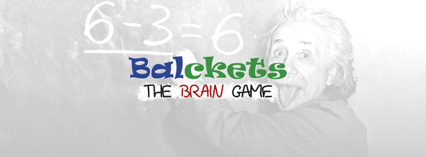
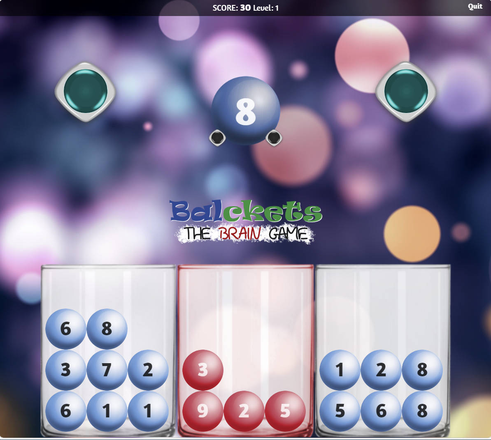

  

## What is Balckets

Balckets is a brain training game.

## Instructions

There are 3 buckets, a white one on the left, a white one on the right and a red one on the center. A ball with a number appears and you must drop the ball on one of these buckets. The purpose of the game is to keep balanced the left and the right buckets.

## Controls

- Click on any bucket to drop the ball in.
- Press the left button to drop the ball in the left bucket,
- Press right button to drop the ball in the right bucket
- Press keyboard left arrow to drop the ball to left bucket,
- Press keyboard right arrow to drop the ball to right bucket,
- Press keyboard down arrow to drop the ball to red bucket

## Score

When the sum of the numbers of the balls in the left bucket is equal with the sum of the numbers of the balls in right bucket, the buckets are balanced, the buckets overturn and empty, and the equal sum of the left and right bucket, minus the sum of the balls in the red bucket, is multiplied with a score relative multiplier and the result is added to your score. If there are balls in the red bucket, the sum of the numbers of the balls is subtracted from the score.

While the score increases, the time you have to decide to which bucket you will drop the ball, decreases. If the time expires, the ball is dropped on the red bucket. The game is over when you try to drop a ball in an full bucket.

 

  

## Versions

There are two versions. A simple html version and a full standalone html version.

## Prerequisites

- A javascript enabled web browser

## Play

Open your browser and visit `http://localhost:3000`

